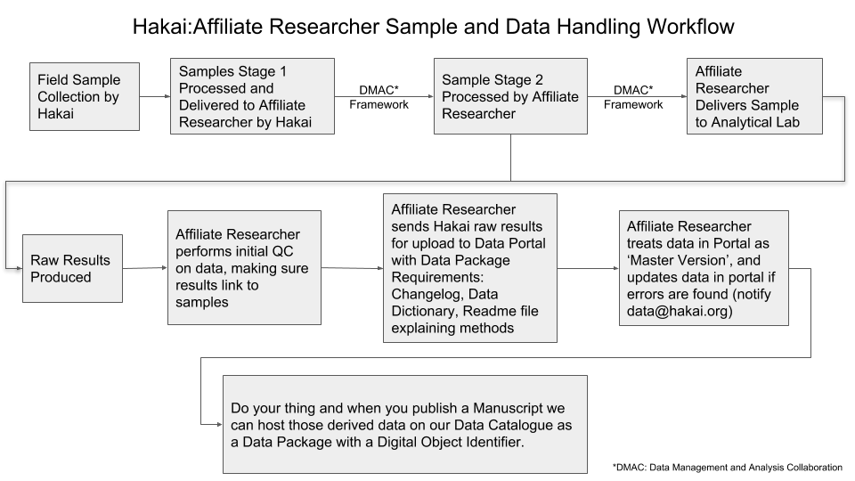
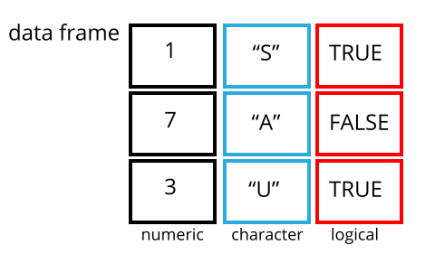

---
title: "R Projects Workshop for the Pelagic Ecosystems Lab and Hakai Affiliates at UBC"
author: "Brett Johnson"
date: "2019/01/16"
output: bookdown::pdf_document2
---

```{r setup, include=FALSE}
knitr::opts_chunk$set(echo = TRUE)

library(tidyverse)
library(lubridate)
library(here)

```

# Pre-workshop material

Did you successfully install and set up all the tools necessary for this workshop? If not do not pass go, do not collect $200. See [README](https://github.com/Br-Johnson/2019-01-21-UBCIOF/blob/gh-pages/README.md)

# Introduction

Why am I giving this workshop?

* Take a team based approach to move the lab forward with a modern, collaborative, and reproducible set of methods

* Facilitate the process of feeding results from University affiliates back into the Hakai Ecological Information Management Database, and Hakai Data Catalogue.

* Reduce the amount of data processing strain on Hakai by providing training to others

* Make your lives as researchers easier and more fun

* Better science less time 

## Filling in the gaps

Most University courses that teach statistics and data analysis focus on teaching statistical techniques but they pay little attention to the tools, workflows, and data wrangling skills required to actually conduct an analysis from start to finish. Questions that often remain un-answered include:

What questions remain for them about how to do a data analysis?

* What is an efficient workflow?
* How do I access and import data?
* How do I clean and manipulate my data into a format to analyze?
* How can I re-run my analysis in case I get new data or someone else wants to run my code?
* How can I collaborate on this analysis?
* How can I get my analysis into a format for someone to meaningfully conduct peer-review?
* How do I efficiently produce a professional report or other artifact of my analysis to communicate results?

## Objectives

The objectives of this workshop are:

1. Become familiar with tools to manage and analyze data efficiently
  + Write code in R-Studio
  + Use `tidyverse`, `dplyr`, `ggplot2` and `tidyr` R packages to analyze your data
  + Use Git and GitHub version control and a changelog 

2. Produce well-documented tidy data-sets that have excellent provenance
  + Data sets contain a change log with a version history of what has changed and the steps used to process data
  + All variables in the dataset are defined in a data dictionary
  + Laboratory, and analytical methods are thoroughly described
  
3. Create reproducible analyses
  + You can easily re-run your code and analysis when you get new data
  + Others can easily find your code and understand the steps you took to analyze your data
  + Raw data are available



## Background

New ideas about what makes a good data analysis are emerging. With data being so readily available in vast quantities, analyzing data using out of date methods — such as Excel — can quickly become overwhelming, not reproducible, error-prone, and difficult to assess for reliability. 

['Duke Scandal'](http://www.cbsnews.com/news/deception-at-duke-fraud-in-cancer-care/)

Science is in a reproducibility crisis.

If we want the work we do to have the greatest impact, others must be able to _easily_ reproduce the work so that they can buildon it. That's what we're trying to do at Hakai.

Some important concepts in defining a good data analysis are:

1) Reproducible Research;

2) Open Science Collaboration

* An additional peer review 
* Collaborate with future you
* Literate Programming
* Nothing to hide; increased reliablity or trustworthyness
* You can share your analyses in hopes that others will improve them

## About me

* BSc. in Wildlife and Fisheries
* Manage the Juvenile Salmon Program at Hakai
* Work with in the IT department as well
* Competent practitioner 
* Task oriented, process driven
* I love 'Aha! moments' and making researchers work easier

Throughought the course I will ask for a helper for each section. If you have some previous experience in a topic, please volunteer to help people out!

Sticky Notes!

## Before We Start

------------

> ### Learning Objectives
>
> * Describe the purpose of the RStudio Script, Console, Environment, and Plots
>   panes.
> * Organize files and directories for a set of analyses as an R
>   Project, and understand the purpose of the working directory.
> * Use the built-in RStudio help interface to search for more information on R
>   functions.
>  * Demonstrate how to provide sufficient information for
>   troubleshooting with the R user community.
------------

## What is R? What is RStudio?

The term "`R`" is used to refer to both the programming language and the
software that interprets the scripts written using it.

[RStudio](https://rstudio.com) is currently a very popular way to not only write
your R scripts but also to interact with the R software. To function correctly, R-studio needs R and therefore both need to be installed on your computer.

## Why learn R?

### R does not involve lots of pointing and clicking, and that's a good thing

The learning curve might be steeper than with other software, but with R, the
results of your analysis do not rely on remembering a succession of pointing
and clicking, but instead on a series of written commands, and that's a good
thing! So, if you want to redo your analysis because you collected more data,
you don't have to remember which button you clicked in which order to obtain
your results; you just have to run your script again.

Working with scripts makes the steps you used in your analysis clear, and the
code you write can be inspected by someone else who can give you feedback and
spot mistakes.

### R code is great for reproducibility

### R is interdisciplinary and extensible

Academics write packages, an extension of R. For instance, R has packages for image analysis, GIS, time series, population
genetics, and a lot more.

### R produces high-quality graphics

The plotting functionalities in R are endless, and allow you to adjust any
aspect of your graph to convey most effectively the message from your data.


### R has a large and welcoming community

Thousands of people use R daily. Many of them are willing to help you through
mailing lists and websites such as [Stack Overflow](https://stackoverflow.com/), or on the [RStudio community](https://community.rstudio.com/).


### Not only is R free, but it is also open-source and cross-platform

Anyone can inspect the source code to see how R works. Because of this
transparency, there is less chance for mistakes, and if you (or someone else)
find some, you can report and fix bugs.

## Knowing your way around RStudio

Let's start by learning about [RStudio](https://www.rstudio.com/), which is an
Integrated Development Environment (IDE) for working with R.

Open up R-Studio.

RStudio is divided into 4 "Panes": the **Source** for your scripts and documents
(top-left, in the default layout), your **Environment/History** (top-right),
your **Files/Plots/Packages/Help/Viewer** (bottom-right), and 
the R **Console** (bottom-left). The placement of these
panes and their content can be customized (see menu, Tools -> Global Options ->
Pane Layout). 

We will use RStudio IDE to write code, navigate the files on our computer,
inspect the variables we are going to create, and visualize the plots we will
generate. RStudio can also be used for other things (e.g., version control,
developing packages, writing Shiny apps) that we will not cover during the
workshop.

## Data Visualization Teaser

Before getting into details let's have a sneak preview to what's possible and where we are heading.

In the R-Studio console type out the following commands with me.

```{r}
library(tidyverse)

# The tidyverse library has a data frame object called mpg, it's about cars.
# Check it out
mpg

ggplot(data = mpg) + 
  geom_point(mapping = aes(x = displ, y = hwy))

# What about this other column class? Maybe we want to see what type of car it is too

ggplot(data = mpg) + 
  geom_point(mapping = aes(x = displ, y = hwy, color = class))

# It would be nice to see a trend line

ggplot(data = mpg) + 
  geom_point(mapping = aes(x = displ, y = hwy, color = class)) +
  geom_smooth(mapping = aes(x = displ, y = hwy))

# The default smoothing line is a loess model, which looks funny here, lets use a linear model

# It would be nice to see a trend line

ggplot(data = mpg) + 
  geom_point(mapping = aes(x = displ, y = hwy, color = class)) +
  geom_smooth(mapping = aes(x = displ, y = hwy), method = lm)

ggsave(here("figs", "mpg.png"))
```


# Project Oriented Workflow

------------

> ### Learning Objectives
>
> * Understand the benefits of version control and set up a GitHub Repository
> * Describe the benefits of a Project Oriented Workflow
> * Organize files and directories for a set of analyses as an R project
> * Understand the purpose of the working directory, and the `here()` package
> * Explain when to use the source editor vs. the console

------------

## Version Control

From Jenny Bryan: 

"Git is a version control system. Its original purpose was to help groups of developers work collaboratively on big software projects. Git manages the evolution of a set of files – called a repository – in a sane, highly structured way. If you have no idea what I’m talking about, think of it as the “Track Changes” features from Microsoft Word on steroids."

GitHub provides a home for your Git-based projects on the internet. If you have no idea what I’m talking about, think of it as DropBox but much, much better. The remote host acts as a distribution channel or clearinghouse for your Git-managed project. It allows other people to see your stuff, sync up with you, and perhaps even make changes."

You can think of having an additional ‘save’ that comes from version control. This additional save, in git terms is known as a _commit_. You save your files like you normally would, but every once in a while you commit your files as an official version to be remembered. A commit can be thought of as a bullet point in the to do list of your analysis, and each commit you make must be accompanied by a message. For example; ‘read in data and tidy it up’, or ‘remove observations from non-standard sampling event, and re-fit GLM’. Git tracks the commits you make in R-Studio locally on your own computer. When you are ready for a series of commits to be made public, you _push_ your commits to your remote repository at GitHub.

Read [Happy Git with R](https://happygitwithr.com) by Jenny Bryan for more details!

## The working directory

The working directory is an important concept to understand. It is the place
from where R will be looking for and saving the files. When you write code for
your project, it should refer to files in relation to the root of your working
directory and only need files within this structure.

Using RStudio projects makes this easy and ensures that your working directory
is set properly. If you need to check it, you can use `getwd()`. If for some
reason your working directory is not what it should be, you can change it in the
RStudio interface by navigating in the file browser where your working directory
should be, and clicking on the blue gear icon "More", and select "Set As Working
Directory". Alternatively you can use `setwd("/path/to/working/directory")` to
reset your working directory. However, your scripts should not include this line
because it will fail on someone else's computer.

It is good practice to keep a set of related data, analyses, and text
self-contained in a single folder, called the **working directory**. All of the
scripts within this folder can then use *relative paths* to files that indicate
where inside the project a file is located (as opposed to absolute paths, which
point to where a file is on a specific computer). Working this way makes it
a lot easier to move your project around on your computer and share it with
others without worrying about whether or not the underlying scripts will still
work.

RStudio's default preferences generally work well, but saving a workspace to
.RData can be cumbersome, especially if you are working with larger datasets.
To turn that off, go to Tools --> 'Global Options' and select the 'Never' option
for 'Save workspace to .RData' on exit.'


### Template folder structure

Using a consistent folder structure across your projects will help keep things
organized, and will also make it easy to find/file things in the future. This
can be especially helpful when you have multiple projects. In general, you may
create directories (folders) for **scripts**, **read_data**, **write_data**, **figs**, and **documents**. You will also wante to creat a CHANGELOG file, which will track the major versions of your data, scripts, and figures.

 - **`read_data/`** Use this folder to store your raw data and don't ever change your raw data!.
   For the sake
   of transparency and [provenance](https://en.wikipedia.org/wiki/Provenance),
   you should *always* keep a copy of your raw data accessible and do as much
   of your data cleanup and preprocessing programmatically (i.e., with scripts,
   rather than manually in excel which you can't reproduce) as possible. 
   Separating raw data from processed data
   is critical.
 - **`write_data/`** Save derived data sets here after cleaning or summarizing.
 - **`documents/`** This would be a place to keep outlines, drafts, and other
   text.
 - **`scripts/`** This would be the location to keep your R scripts for
   different analyses or plotting, and potentially a separate folder for your
   functions (more on that later).
 - **`figs/`** Programatically save the output of to `figs/` using `ggsave()`.

You may want additional directories or subdirectories depending on your project
needs, but these should form the backbone of your working directory.


For this workshop, we will need a `read_data/` folder to store our raw data, and we
will use `write_data/` for when we learn how to export data as CSV files, and
`figs/` folder for the figures that we will save.

* Under the `Files` tab on the right of the screen, click on `New Folder` and
  create a folder named `data` within your newly created working directory
  (e.g., `~/data-carpentry/read_data`). (Alternatively, type `dir.create("data")` at
  your R console.) Repeat these operations to create a `write_data/` and a
  `figs/` folders.
* Again under the `Files` tab, click on `New File` and create a new `Text File`. Type #CHANGELOG on the first line and save the new file as CHANGELOG.TXT in the root of your working directory.

We are going to keep the script in the root of our working directory because we
are only going to use one file and it will make things easier.

Your working directory should now look like mine.


### The `here()` package

To avoid having to set your working directory completely, a recommended method to work with relative file paths is using the `here()` package in conjunction with R-Studio projects. When you create a new R-Studio project, a .Rproj file is automatically created in the new folder that you created for the project. The `here()` package will automatically set your working directory to wherever your .Rproj file is saved. That means you can save a file like this: `write_csv(file_name, here("data", "file_name.csv"))`. Using `here()` means that if you access your collaborators folder where the .Rproj file is and they have been using relative paths using `here()`, the scripts should all just work—no chaning working directories or absolute file paths.

Questions?

## Interacting with R

The basis of programming is that we write down instructions for the computer to
follow, and then we tell the computer to follow those instructions. We write, or
*code*, instructions in R because it is a common language that both the computer
and we can understand. We call the instructions *commands* and we tell the
computer to follow the instructions by *running* those commands. We use *functions* that are part of *packages*.

There are two main ways of interacting with R: by using the console or by using
script files (plain text files that contain your code). The console pane (in
RStudio, the bottom left panel) is the place where commands written in the R
language can be typed and executed immediately by the computer. It is also where
the results will be shown for commands that have been executed. You can type
commands directly into the console and press `Enter` to execute those commands,
but they will be forgotten when you close the session.

Because we want our code and workflow to be reproducible, it is better to type
the commands we want in the script editor, and save the script. This way, there
is a complete record of what we did, and anyone (including our future selves!)
can easily replicate the results on their computer.

At some point in your analysis you may want to check the content of a variable
or the structure of an object, without necessarily keeping a record of it in
your script. You can type these commands and execute them directly in the
console.  RStudio provides the <kbd>`Ctrl`</kbd> + <kbd>`1`</kbd> and
<kbd>`Ctrl`</kbd> + <kbd>`2`</kbd> shortcuts allow you to jump between the
script and the console panes.

## R Markdown

Create a new R Markdown File.

File > New > R Markdown

### What's Markdown?

Markdown is a lightweight markup language, like html but way simpler:

Single hashtags heading 1, 3 for heading 3: "###", 

### Heading 3 Example

Use '*' around words for bold or italics.

Bullet points also with a single '*'

Markdown cheatsheet in help > cheatsheets.

R Markdown is a file format that allows you to organize your notes, code, and results in a single document. It’s a great tool for “literate programming” – the idea that your code should be readable by humans as well as computers! It also keeps your writing and results together, so if you collect some new data or change how you clean the data, you just have to re-compile the document and you’re up to date!

What your final data product is going to be will dictate what your final scripts will be.  R Markdown files formats that have pre-made templates and solutions that are easy to modify to suit your needs include:

* Analysis report templates (html, .pdf, or .doc outputs);  
* A Manuscript;
* A Book;
* A Dissertation;
* A Research Compendium;
* A Slideshow;
* An interactive dashboard;
* An R Package
* A website

As a baseline I recommend .Rmd as the final format because this gives you a lot of flexibility in terms of polished data products.


### Knitting your document

Knit the document!

# Intro to R

------------

> ### Learning Objectives
>
> * Define the following terms as they relate to R: object, assign, call,
>   function, arguments, options.
> * Assign values to objects in R.
> * Learn how to _name_ objects
> * Use comments to inform script.
> * Solve simple arithmetic operations in R.
> * Call functions and use arguments to change their default options.
> * Inspect the content of vectors and manipulate their content.
------------

## Creating objects in R

```{r, echo=FALSE, purl=TRUE}
### Creating objects in R
```

You can get output from R simply by typing math in the console:

```{r, purl=FALSE}
3 + 5
12 / 7
```

However, to do useful and interesting things, we need to assign _values_ to
_objects_. To create an object, we need to give it a name followed by the
assignment operator `<-`, and the value we want to give it:

```{r, purl=FALSE}
weight_kg <- 55
```

`<-` is the assignment operator. It assigns values on the right to objects on
the left. So, after executing `x <- 3`, the value of `x` is `3`. The arrow can
be read as 3 **goes into** `x`.

Objects can be given any name such as `x`, `current_temperature`, or
`subject_id`. You want your object names to be explicit and not too long. They
cannot start with a number (`2x` is not valid, but `x2` is). R is case sensitive
(e.g., `weight_kg` is different from `Weight_kg`).

Avoid using dots, use underscores to separate words.

Using a consistent coding style makes your code clearer to read for your future self and your collaborators. Use the [tidyverse's](http://style.tidyverse.org/). The tidyverse's is very comprehensive and may seem overwhelming at first. You can install the **`stylr`** package to automatically check for issues in the styling of your code.

We can also change an object's value by assigning it a new one:

```{r, purl=FALSE}
weight_kg <- 57.5
2.2 * weight_kg
```

This means that assigning a value to one object does not change the values of
other objects  For example, let's store the animal's weight in pounds in a new
object, `weight_lb`:

```{r, purl=FALSE}
weight_lb <- 2.2 * weight_kg
```

and then change `weight_kg` to 100.

```{r, purl=FALSE}
weight_kg <- 100
```

What do you think is the current content of the object `weight_lb`? 126.5 or 220?

### Comments

The comment character in R is `#`, anything to the right of a `#` in a script
will be ignored by R. It is useful to leave notes, and explanations in your
scripts.
RStudio makes it easy to comment or uncomment a paragraph: after selecting the
lines you  want to comment, press at the same time on your keyboard
<kbd>Ctrl</kbd> + <kbd>Shift</kbd> + <kbd>C</kbd>. If you only want to comment
out one line, you can put the cursor at any location of that line (i.e. no need 
to select the whole line), then press <kbd>Ctrl</kbd> + <kbd>Shift</kbd> + 
<kbd>C</kbd>.

### Functions and their arguments

Functions are "canned scripts" that automate more complicated sets of commands
including operations assignments, etc. Many functions are predefined, or can be
made available by importing R *packages* (more on that later). A function
usually gets one or more inputs called *arguments*. Functions often (but not
always) return a *value*. A typical example would be the function `sqrt()`. The
input (the argument) must be a number, and the return value (in fact, the
output) is the square root of that number. Executing a function ('running it')
is called *calling* the function. An example of a function call is:

```{r, eval=FALSE, purl=FALSE}
b <- sqrt(a)
```

Here, the value of `a` is given to the `sqrt()` function, the `sqrt()` function
calculates the square root, and returns the value which is then assigned to
the object `b`. This function is very simple, because it takes just one argument.

The return 'value' of a function need not be numerical (like that of `sqrt()`),
and it also does not need to be a single item: it can be a set of things, or
even a dataset. We'll see that when we read data files into R.

Arguments can be anything, not only numbers or filenames, but also other
objects. Exactly what each argument means differs per function, and must be
looked up in the documentation (see below). Some functions take arguments which
may either be specified by the user, or, if left out, take on a *default* value:
these are called *options*. Options are typically used to alter the way the
function operates, such as whether it ignores 'bad values', or what symbol to
use in a plot.  However, if you want something specific, you can specify a value
of your choice which will be used instead of the default.

Let's try a function that can take multiple arguments: `round()`.

```{r, results='show', purl=FALSE}
round(3.14159)
```

Here, we've called `round()` with just one argument, `3.14159`, and it has
returned the value `3`.  That's because the default is to round to the nearest
whole number. If we want more digits we can see how to do that by getting
information about the `round` function.  We can use `args(round)` or look at the
help for this function using `?round`.

```{r, results='show', purl=FALSE}
args(round)
```

```{r, eval=FALSE, purl=FALSE}
?round
```

We see that if we want a different number of digits, we can
type `digits=2` or however many we want.

```{r, results='show', purl=FALSE}
round(3.14159, digits = 2)
```

If you provide the arguments in the exact same order as they are defined you
don't have to name them:

```{r, results='show', purl=FALSE}
round(3.14159, 2)
```

And if you do name the arguments, you can switch their order:

```{r, results='show', purl=FALSE}
round(digits = 2, x = 3.14159)
```

It's good practice to put the non-optional arguments (like the number you're
rounding) first in your function call, and to specify the names of all optional
arguments.  If you don't, someone reading your code might have to look up the
definition of a function with unfamiliar arguments to understand what you're
doing.


## Vectors and data types

A vector is the most common and basic data type in R, and is pretty much
the workhorse of R. A vector is composed by a series of values, which can be
either numbers or characters. We can assign a series of values to a vector using
the `c()` function. For example we can create a vector of animal weights and assign
it to a new object `weight_g`:

```{r, purl=FALSE}
weight_g <- c(50, 60, 65, 82)
weight_g
```

```{r, purl=FALSE}
animals <- c("mouse", "rat", "dog")
animals
```


An **atomic vector** is the simplest R **data type** and is a linear vector of a single type. Above, we saw 
2 of the 6 main **atomic vector** types  that R
uses: `"character"` and `"numeric"` (or `"double"`). These are the basic building blocks that
all R objects are built from. The other 4 **atomic vector** types are:

* `"logical"` for `TRUE` and `FALSE` (the boolean data type)
* `"integer"` for integer numbers (e.g., `2L`, the `L` indicates to R that it's an integer)
* `"complex"` to represent complex numbers with real and imaginary parts (e.g.,
  `1 + 4i`) and that's all we're going to say about them
* `"raw"` for bitstreams that we won't discuss further

You can check the type of your vector using the `typeof()` function and inputting your vector as the argument.

Vectors are one of the many **data structures** that R uses. Other important
ones are lists (`list`), matrices (`matrix`), data frames (`data.frame`),
factors (`factor`) and arrays (`array`).

## Starting with Data

------------

> ### Learning Objectives
>
> * Describe what a data frame is.
> * Load external data from a .csv file into a data frame.
> * Summarize the contents of a data frame.

------------

### Presentation of the Survey Data

```{r, echo=FALSE, purl=TRUE}
### Presentation of the survey data
```

We are studying the species repartition and weight of animals caught in plots in our study
area. The dataset is stored as a comma separated value (CSV) file.
Each row holds information for a single animal, and the columns represent:

| Column           | Description                        |
|------------------|------------------------------------|
| record\_id       | Unique id for the observation      |
| month            | month of observation               |
| day              | day of observation                 |
| year             | year of observation                |
| plot\_id         | ID of a particular plot            |
| species\_id      | 2-letter code                      |
| sex              | sex of animal ("M", "F")           |
| hindfoot\_length | length of the hindfoot in mm       |
| weight           | weight of the animal in grams      |
| genus            | genus of animal                    |
| species          | species of animal                  |
| taxon             | e.g. Rodent, Reptile, Bird, Rabbit |
| plot\_type       | type of plot                       |

We are going to use the R function `download.file()` to download the CSV file
that contains the survey data from figshare, and we will use `read_csv()` to
load into memory the content of the CSV file as an object of class `data.frame`. 
Inside the download.file command, the first entry is a character string with the source URL 
("https://ndownloader.figshare.com/files/2292169"). This source URL downloads a CSV file from 
figshare. The text after the comma ("data/portal_data_joined.csv") is the destination of the 
file on your local machine. You'll need to have a folder on your machine called "read_data" where 
you'll download the file. So this command downloads a file from figshare, names it 
"portal_data_joined.csv," and adds it to a preexisting folder named "data."

```{r, eval=FALSE, purl=TRUE}
library(tidyverse)

download.file(url="https://ndownloader.figshare.com/files/2292169",
              destfile = "read_data/portal_data_joined.csv")
```

You are now ready to load the data:

```{r, eval=TRUE,  purl=FALSE}
surveys <- read_csv(here("read_data", "portal_data_joined.csv"))
```

This statement doesn't produce any output because assignments don't display anything. If we want to check that our data has been
loaded, we can see the contents of the data frame by typing its name: `surveys`.

Wow... that was a lot of output. At least it means the data loaded
properly. Let's check the top (the first 6 lines) of this data frame using the
function `head()`:

```{r, results='show', purl=FALSE}
head(surveys)
## Try also
## View(surveys)
```

### What are data frames?

Data frames are the _de facto_ data structure for most tabular data, and what we
use for statistics and plotting.

A data frame can be created by hand, but most commonly they are generated by the
functions `read_csv()` or `read.table()`; in other words, when importing
spreadsheets from your hard drive (or the web).

A data frame is the representation of data in the format of a table where the
columns are vectors that all have the same length. Because columns are
vectors, each column must contain a single type of data (e.g., characters, integers,
factors). For example, here is a figure depicting a data frame comprising a
numeric, a character, and a logical vector.




We can see this when inspecting the <b>str</b>ucture of a data frame
with the function `str()`:

```{r, purl=FALSE}
str(surveys)
```

### Inspecting `data.frame` Objects

We already saw how the functions `head()` and `str()` can be useful to check the
content and the structure of a data frame. Here is a non-exhaustive list of
functions to get a sense of the content/structure of the data. Let's try them out!

* Size:
    * `dim(surveys)` - returns a vector with the number of rows in the first element,
          and the number of columns as the second element (the **dim**ensions of
          the object)
    * `nrow(surveys)` - returns the number of rows
    * `ncol(surveys)` - returns the number of columns

* Summary:
    * `str(surveys)` - structure of the object and information about the class, length and
	   content of  each column
    * `summary(surveys)` - summary statistics for each column

Note: most of these functions are "generic", they can be used on other types of
objects besides `data.frame`.

### Indexing and subsetting data frames

```{r, echo=FALSE, purl=TRUE}

## Indexing and subsetting data frames
```


Our survey data frame has rows and columns (it has 2 dimensions), if we want to
extract some specific data from it, we need to specify the "coordinates" we
want from it. Row numbers come first, followed by column numbers. However, note
that different ways of specifying these coordinates lead to results with
different classes.


```{r, purl=FALSE}
# first element in the first column of the data frame (as a vector)
surveys[1, 1]   
# first element in the 6th column (as a vector)
surveys[1, 6]   
# first column of the data frame (as a vector)
surveys[, 1]    
# first column of the data frame (as a data.frame)
surveys[1]      
# first three elements in the 7th column (as a vector)
surveys[1:3, 7] 
# the 3rd row of the data frame (as a data.frame)
surveys[3, ]    
# equivalent to head_surveys <- head(surveys)
head_surveys <- surveys[1:6, ] 
```

`:` is a special function that creates numeric vectors of integers in increasing
or decreasing order, test `1:10` and `10:1` for instance.

You can also exclude certain indices of a data frame using the "`-`" sign:

```{r, purl=FALSE}
surveys[, -1]          # The whole data frame, except the first column
surveys[-c(7:34786), ] # Equivalent to head(surveys)
```

Data frames can be subset by calling indices (as shown previously), but also by calling their column names directly:

```{r, eval = FALSE, purl=FALSE}
surveys["species_id"]       # Result is a data.frame
surveys[, "species_id"]     # Result is a vector
surveys[["species_id"]]     # Result is a vector
surveys$species_id          # Result is a vector
```

In RStudio, you can use the autocompletion feature to get the full and correct names of the columns.

## Data Manipulation

------------

> ### Learning Objectives
>
> * Describe the purpose of the **`dplyr`** and **`tidyr`** packages.
> * Select certain columns in a data frame with the **`dplyr`** function `select`.
> * Select certain rows in a data frame according to filtering conditions with the **`dplyr`** function `filter` .
> * Link the output of one **`dplyr`** function to the input of another function with the 'pipe' operator `%>%`.
> * Add new columns to a data frame that are functions of existing columns with `mutate`.
> * Use `group_by`, and `summarize` to split a data frame into groups of observations, apply a summary statistics for each group, and then combine the results.
> * Describe the concept of a wide and a long table format and for which purpose those formats are useful.
> * Describe what key-value pairs are.
> * Reshape a data frame from long to wide format and back with the `spread` and `gather` commands from the **`tidyr`** package.

------------

### **`dplyr`** and **`tidyr`**

Bracket subsetting is handy, but it can be cumbersome and difficult to read,
especially for complicated operations. Enter **`dplyr`**. **`dplyr`** is a package for
making tabular data manipulation easier. It pairs nicely with **`tidyr`** which enables you to swiftly convert between different data formats for plotting and analysis.

Packages in R are basically sets of additional functions that let you do more
stuff. The functions we've been using so far, like `str()` or `data.frame()`,
come built into R; packages give you access to more of them. Before you use a
package for the first time you need to install it on your machine, and then you
should import it in every subsequent R session when you need it. You should
already have installed the **`tidyverse`** package. This is an
"umbrella-package" that installs several packages useful for data analysis which
work together well such as **`tidyr`**, **`dplyr`**, **`ggplot2`**, **`tibble`**, etc.

To load the package, type:

```{r, message = FALSE, purl = FALSE}
## load the tidyverse packages, incl. dplyr
library("tidyverse")
```


The package **`dplyr`** provides easy tools for the most common data manipulation
tasks. It is built to work directly with data frames.

The package **`tidyr`** addresses the common problem of wanting to reshape your data for plotting and use by different R functions. Sometimes we want data sets where we have one row per measurement. Sometimes we want a data frame where each measurement type has its own column, and rows are instead more aggregated groups - like plots or aquaria. Moving back and forth between these formats is nontrivial, and **`tidyr`** gives you tools for this and more sophisticated  data manipulation.

To learn more about **`dplyr`** and **`tidyr`** after the workshop, you may want to check out this
[handy data transformation with **`dplyr`** cheatsheet](https://github.com/rstudio/cheatsheets/raw/master/data-transformation.pdf) and this [one about **`tidyr`**](https://github.com/rstudio/cheatsheets/raw/master/data-import.pdf).


```{r, results = 'hide', purl = FALSE}
surveys <- read_csv(here("read_data", "portal_data_joined.csv"))

## inspect the data
str(surveys)

## preview the data
# View(surveys)
```

We're going to learn some of the most common **`dplyr`** functions:

- `select()`: subset columns
- `filter()`: subset rows on conditions
- `mutate()`: create new columns by using information from other columns
- `group_by()` : creates groups based on categorical data in a column
- `summarize()`: create summary statisitcs on grouped data
- `arrange()`: sort results
- `count()`: count discrete values

### Selecting columns and filtering rows

To select columns of a data frame, use `select()`. The first argument
to this function is the data frame (`surveys`), and the subsequent
arguments are the columns to keep.

```{r, results = 'hide', purl = FALSE}
select(surveys, plot_id, species_id, weight)
```

To select all columns *except* certain ones, put a "-" in front of
the variable to exclude it.

```{r, results = 'hide', purl = FALSE}
select(surveys, -record_id, -species_id)
```

This will select all the variables in `surveys` except `record_id`
and `species_id`.

To choose rows based on a specific criteria, use `filter()`:

```{r, purl = FALSE}
filter(surveys, year == 1995)
```

### Pipes

What if you want to select and filter at the same time? There are three
ways to do this: use intermediate steps, nested functions, or pipes.

With intermediate steps, you create a temporary data frame and use
that as input to the next function, like this:

```{r, purl = FALSE}
surveys2 <- filter(surveys, weight < 5)
surveys_sml <- select(surveys2, species_id, sex, weight)
```

This is readable, but can clutter up your workspace with lots of objects that you have to name individually. With multiple steps, that can be hard to keep track of.

The a sometimes better option, *pipes*, are a recent addition to R. Pipes let you take
the output of one function and send it directly to the next, which is useful
when you need to do many things to the same dataset.  Pipes in R look like
`%>%` and are made available via the **`magrittr`** package, installed automatically
with **`dplyr`**. If you use RStudio, you can type the pipe with <kbd>Ctrl</kbd>
+ <kbd>Shift</kbd> + <kbd>M</kbd> if you have a PC or <kbd>Cmd</kbd> + 
<kbd>Shift</kbd> + <kbd>M</kbd> if you have a Mac.

```{r, purl = FALSE}
surveys %>%
  filter(weight < 5) %>%
  select(species_id, sex, weight)
```

In the above code, we use the pipe to send the `surveys` dataset first through
`filter()` to keep rows where `weight` is less than 5, then through `select()`
to keep only the `species_id`, `sex`, and `weight` columns. Since `%>%` takes
the object on its left and passes it as the first argument to the function on
its right, we don't need to explicitly include the data frame as an argument
to the `filter()` and `select()` functions any more.

Some may find it helpful to read the pipe like the word "then". For instance,
in the above example, we took the data frame `surveys`, *then* we `filter`ed
for rows with `weight < 5`, *then* we `select`ed columns `species_id`, `sex`,
and `weight`. The **`dplyr`** functions by themselves are somewhat simple,
but by combining them into linear workflows with the pipe, we can accomplish
more complex manipulations of data frames.

If we want to create a new object with this smaller version of the data, we
can assign it a new name:

```{r, purl = FALSE}
surveys_sml <- surveys %>%
  filter(weight < 5) %>%
  select(species_id, sex, weight)

surveys_sml
```

Note that the final data frame is the leftmost part of this expression.

> ### Challenge {.challenge}
>
>  Using pipes, subset the `surveys` data to include animals collected before
>  1995 and retain only the columns `year`, `sex`, and `weight`.
> 
> 
> ```{r, answer=TRUE, eval=FALSE, purl=FALSE}
> surveys %>%
>     filter(year < 1995) %>%
>     select(year, sex, weight)
> ```

```{r, eval=FALSE, purl=TRUE, echo=FALSE}
## Pipes Challenge:
##  Using pipes, subset the data to include animals collected
##  before 1995, and retain the columns `year`, `sex`, and `weight.`
```

### Mutate

Frequently you'll want to create new columns based on the values in existing
columns, for example to do unit conversions, or to find the ratio of values in two
columns. For this we'll use `mutate()`.

To create a new column of weight in kg:

```{r, purl = FALSE}
surveys %>%
  mutate(weight_kg = weight / 1000)
```

You can also create a second new column based on the first new column within the same call of `mutate()`:

```{r, purl = FALSE}
surveys %>%
  mutate(weight_kg = weight / 1000,
         weight_kg2 = weight_kg * 2)
```

If this runs off your screen and you just want to see the first few rows, you
can use a pipe to view the `head()` of the data. (Pipes work with non-**`dplyr`**
functions, too, as long as the **`dplyr`** or `magrittr` package is loaded).

```{r, purl = FALSE}
surveys %>%
  mutate(weight_kg = weight / 1000) %>%
  head()
```

The first few rows of the output are full of `NA`s, so if we wanted to remove
those we could insert a `filter()` in the chain:

```{r, purl = FALSE}
surveys %>%
  drop_na(weight) %>%
  mutate(weight_kg = weight / 1000) %>%
  head()
```

`drop_na()` is a function that determines whether something is an `NA`, and will drop the whole row if there is an NA in the column you specified (weight in this case). Using `drop_na()` with no column named will look for an NA in any column and drop the whole row if there are any NAs

> ### Challenge {.challenge}
>
>  Create a new data frame from the `surveys` data that meets the following
>  criteria: contains only the `species_id` column and a new column called
>  `hindfoot_half` containing values that are half the `hindfoot_length` values.
>  In this `hindfoot_half` column, there are no `NA`s and all values are less
>  than 30.
>
>  **Hint**: think about how the commands should be ordered to produce this data frame!
> 
> ```{r, answer=TRUE, eval=FALSE, purl=FALSE}
> surveys_hindfoot_half <- surveys %>%
>     drop_na(hindfoot_length) %>%
>     mutate(hindfoot_half = hindfoot_length / 2) %>%
>     filter(hindfoot_half < 30) %>%
>     select(species_id, hindfoot_half)
> ```
 

```{r, eval=FALSE, purl=TRUE, echo=FALSE}
## Mutate Challenge:
##  Create a new data frame from the `surveys` data that meets the following
##  criteria: contains only the `species_id` column and a column that
##  contains values that are half the `hindfoot_length` values (e.g. a
##  new column `hindfoot_half`). In this `hindfoot_half` column, there are
##  no NA values and all values are < 30.

##  Hint: think about how the commands should be ordered to produce this data frame!
```

### The `summarize()` function

`group_by()` is often used together with `summarize()`, which collapses each
group into a single-row summary of that group.  `group_by()` takes as arguments
the column names that contain the **categorical** variables for which you want
to calculate the summary statistics. So to compute the mean `weight` by sex:

```{r, purl = FALSE}
surveys %>%
  group_by(sex) %>%
  summarize(mean_weight = mean(weight, na.rm = TRUE))
```

You may also have noticed that the output from these calls doesn't run off the
screen anymore. It's one of the advantages of `tbl_df` over data frame.

You can also group by multiple columns:

```{r, purl = FALSE}
surveys %>%
  group_by(sex, species_id) %>%
  summarize(mean_weight = mean(weight, na.rm = TRUE))
```

When grouping both by `sex` and `species_id`, the last few rows are for animals
that escaped before their sex and body weights could be determined. You may notice
that the last column does not contain `NA` but `NaN` (which refers to "Not a
Number"). To avoid this, we can remove the missing values for weight before we
attempt to calculate the summary statistics on weight. Because the missing
values are removed first, we can omit `na.rm = TRUE` when computing the mean:

```{r, purl = FALSE}
surveys %>%
  drop_na(weight) %>%
  group_by(sex, species_id) %>%
  summarize(mean_weight = mean(weight))
```

Here, again, the output from these calls doesn't run off the screen
anymore. If you want to display more data, you can use the `print()` function
at the end of your chain with the argument `n` specifying the number of rows to
display:

```{r, purl = FALSE}
surveys %>%
  filter(!is.na(weight)) %>%
  group_by(sex, species_id) %>%
  summarize(mean_weight = mean(weight)) %>%
  print(n = 15)
```

Once the data are grouped, you can also summarize multiple variables at the same
time (and not necessarily on the same variable). For instance, we could add a
column indicating the minimum weight for each species for each sex:

```{r, purl = FALSE}
surveys %>%
  filter(!is.na(weight)) %>%
  group_by(sex, species_id) %>%
  summarize(mean_weight = mean(weight),
            min_weight = min(weight))
```

It is sometimes useful to rearrange the result of a query to inspect the values. For instance, we can sort on `min_weight` to put the lighter species first:


```{r, purl = FALSE}
surveys %>%
  filter(!is.na(weight)) %>%
  group_by(sex, species_id) %>%
  summarize(mean_weight = mean(weight),
            min_weight = min(weight)) %>%
  arrange(min_weight)
```

To sort in descending order, we need to add the `desc()` function. If we want to sort the results by decreasing order of mean weight:

```{r, purl = FALSE}
surveys %>%
  filter(!is.na(weight)) %>%
  group_by(sex, species_id) %>%
  summarize(mean_weight = mean(weight),
            min_weight = min(weight)) %>%
  arrange(desc(mean_weight))
```


### Counting

When working with data, we often want to know the number of observations found
for each factor or combination of factors. For this task, **`dplyr`** provides
`count()`. For example, if we wanted to count the number of rows of data for
each sex, we would do:

```{r, purl = FALSE}
surveys %>%
    count(sex) 
```

The `count()` function is shorthand for something we've already seen: grouping by a variable, and summarizing it by counting the number of observations in that group. In other words, `surveys %>% count()` is equivalent to:  

```{r, purl = FALSE}
surveys %>%
    group_by(sex) %>%
    summarise(count = n())
```

For convenience, `count()` provides the `sort` argument:  

```{r, purl = FALSE}
surveys %>%
    count(sex, sort = TRUE) 
```

> ### Challenge {.challenge}
>
> 1. How many animals were caught in each `plot_type` surveyed?
>
> ```{r, answer=TRUE, purl=FALSE}
> surveys %>%
>     count(plot_type) 
> ```
>
> 2. Use `group_by()` and `summarize()` to find the mean, min, and max hindfoot
> length for each species (using `species_id`). Also add the number of
> observations (hint: see `?n`).
>
> ```{r, answer=TRUE, purl=FALSE}
> surveys %>%
>     filter(!is.na(hindfoot_length)) %>%
>     group_by(species_id) %>%
>     summarize(
>         mean_hindfoot_length = mean(hindfoot_length),
>         min_hindfoot_length = min(hindfoot_length),
>         max_hindfoot_length = max(hindfoot_length),
>         n = n()
>     )
> ```
>
> 3. What was the heaviest animal measured in each year? Return the columns `year`,
> `genus`, `species_id`, and `weight`.
>
> ```{r, answer=TRUE, purl=FALSE}
> surveys %>%
>     filter(!is.na(weight)) %>%
>     group_by(year) %>%
>     filter(weight == max(weight)) %>%
>     select(year, genus, species, weight) %>%
>     arrange(year)
> ```


```{r, eval=FALSE, purl=TRUE, echo=FALSE}
## Count Challenges:
##  1. How many animals were caught in each `plot_type` surveyed?

##  2. Use `group_by()` and `summarize()` to find the mean, min, and max
## hindfoot length for each species (using `species_id`). Also add the number of
## observations (hint: see `?n`).

##  3. What was the heaviest animal measured in each year? Return the
##  columns `year`, `genus`, `species_id`, and `weight`.
```

## Exporting data

Now that you have learned how to use **`dplyr`** to extract information from
or summarize your raw data, you may want to export these new processed data sets to share them with your collaborators or for archival.

Never write to `read_data/`

Similar to the `read_csv()` function used for reading CSV files into R, there is
a `write_csv()` function that generates CSV files from data frames.

```{r}
write_csv(surveys_sml, here("write_data", "surveys_sml.csv"))
```

* Knit your document

* Commit, Pull, Push

Questions?

# DAY 2

## Objectives

The objectives of this workshop are:

1. Become familiar with tools to manage and analyze data efficiently
  + Write code in R-Studio
  + Use `tidyverse`, `dplyr`, `ggplot2` and `tidyr` R packages to analyze your data
  + Use Git and GitHub version control and a changelog 

2. Produce well-documented tidy data-sets that have excellent provenance
  + Data sets contain a change log with a version history of what has changed and the steps used to process data
  + All variables in the dataset are defined in a data dictionary
  + Laboratory, and analytical methods are thoroughly described
  
3. Create reproducible analyses
  + You can easily re-run your code and analysis when you get new data
  + Others can easily find your code and understand the steps you took to analyze your data
  + Raw data are available


# Tidy Data in Spreadsheets

## Principles of tidy data

Tidy data

1. Each variable has its own column
2. Each observation has its own row
3. Each value must have its own cell
4. Each type of observational unit forms a table

Sometimes your you want to spread the observations of on variable across multiple columns.

In `surveys` , the rows of `surveys` contain the values of variables associated
with each record (the unit), values such the weight or sex of each animal 
associated with each record. What if instead of comparing records, we 
wanted to compare the different mean weight of each species between plots? (Ignoring `plot_type` for simplicity).

We'd need to create a new table where each row (the unit) is comprised of values of variables associated with each plot. In practical terms this means the values
of the species in `genus` would become the names of column variables and the cells would contain the values of the mean weight observed on each plot.

Having created a new table, it is therefore straightforward to explore the 
relationship between the weight of different species within, and between, the
plots. The key point here is that we are still following a tidy data structure,
but we have **reshaped** the data according to the observations of interest:
average species weight per plot instead of recordings per date.

The opposite transformation would be to transform column names into values of
a variable.

We can do both these of transformations with two `tidyr` functions, `spread()`
and `gather()`.

### Spreading

`spread()` takes three principal arguments:

1. the data 
2. the *key* column variable whose values will become new column names.  
3. the *value* column variable whose values will fill the new column variables.

Further arguments include `fill` which, if set, fills in missing values with 
the value provided.

Let's use `spread()` to transform surveys to find the mean weight of each 
species in each plot over the entire survey period. We use `filter()`,
`group_by()` and `summarise()` to filter our observations and variables of 
interest, and create a new variable for the `mean_weight`. We use the pipe as 
before too.

```{r, purl=FALSE}
surveys_gw <- surveys %>%
  filter(!is.na(weight)) %>%
  group_by(genus, plot_id) %>%
  summarize(mean_weight = mean(weight))

str(surveys_gw)
```

This yields `surveys_gw` where the observations for each plot are spread across
multiple rows, 196 observations of 3 variables. 
Using `spread()` to key on `genus` with values from `mean_weight` this becomes
24 observations of 11 variables, one row for each plot. We again use pipes:

```{r, purl=FALSE}
surveys_spread <- surveys_gw %>%
  spread(key = genus, value = mean_weight)

str(surveys_spread)
```


We could now plot comparisons between the weight of species in different plots, 
although we may wish to fill in the missing values first.

```{r, purl=FALSE}
surveys_gw %>%
  spread(genus, mean_weight, fill = 0) %>%
  head()
```

### Gathering

The opposing situation could occur if we had been provided with data in the
form of `surveys_spread`, where the genus names are column names, but we 
wish to treat them as values of a genus variable instead.

In this situation we are gathering the column names and turning them into a
pair of new variables. One variable represents the column names as values, and
the other variable contains the values previously associated with the column names.

`gather()` takes four principal arguments:

1. the data
2. the *key* column variable we wish to create from column names.
3. the *values* column variable we wish to create and fill with values 
associated with the key.
4. the names of the columns we use to fill the key variable (or to drop).

To recreate `surveys_gw` from `surveys_spread` we would create a key called
`genus` and value called `mean_weight` and use all columns except `plot_id` for
the key variable. Here we drop `plot_id` column with a minus sign.

```{r, purl=FALSE}
surveys_gather <- surveys_spread %>%
  gather(key = genus, value = mean_weight, -plot_id)

str(surveys_gather)
```


Note that now the `NA` genera are included in the re-gathered format. Spreading
and then gathering can be a useful way to balance out a dataset so every
replicate has the same composition.

We could also have used a specification for what columns to include. This can be
useful if you have a large number of identifying columns, and it's easier to
specify what to gather than what to leave alone. And if the columns are in a
row, we don't even need to list them all out - just use the `:` operator!

```{r, purl=FALSE}
surveys_spread %>%
  gather(key = genus, value = mean_weight, Baiomys:Spermophilus) %>%
  head()
```

> ### Challenge {.challenge}
>
> 1. Spread the `surveys` data frame with `year` as columns, `plot_id` 
>   as rows, and the
>   number of genera per plot as the values. You will need to summarize before
>   reshaping, and use the function `n_distinct()` to get the number of unique
>   genera within a particular chunk of data. It's a powerful function! See
>   `?n_distinct` for more.
> 
> ```{r, answer=TRUE, purl=FALSE}
> rich_time <- surveys %>%
>   group_by(plot_id, year) %>%
>   summarize(n_genera = n_distinct(genus)) %>%
>   spread(year, n_genera)
> 
> head(rich_time)
> ```
>
> 2. Now take that data frame and `gather()` it again, so each row is a unique
>    `plot_id` by `year` combination.
>
> ```{r, answer=TRUE, purl=FALSE}
> rich_time %>%
>   gather(year, n_genera, -plot_id)
> ```
>
> 3. The `surveys` data set has
>    two measurement columns: `hindfoot_length` and `weight`.  This makes it
>    difficult to do things like look at the relationship between mean values of
>    each measurement per year in different plot types. Let's walk through a
>    common solution for this type of problem. First, use `gather()` to create a
>     dataset where we have a key column called `measurement` and a
>    `value` column that takes on the value of either `hindfoot_length` or
>    `weight`. *Hint*: You'll need to specify which columns are being gathered.
>
> ```{r, answer=TRUE, purl=FALSE}
> surveys_long <- surveys %>%
>   gather(measurement, value, hindfoot_length, weight)
> ```
>
> 4. With this new data set, calculate the average of each
>    `measurement` in each `year` for each different `plot_type`. Then
>    `spread()` them into a data set with a column for `hindfoot_length` and
>    `weight`. *Hint*: You only need to specify the key and value
>    columns for `spread()`.
>
> ```{r, answer=TRUE, purl=FALSE}
> surveys_long %>%
>   group_by(year, measurement, plot_type) %>%
>   summarize(mean_value = mean(value, na.rm=TRUE)) %>%
>   spread(measurement, mean_value)
> ```

```{r, eval=FALSE, purl=TRUE, echo=FALSE}
## Reshaping challenges

## 1. Make a wide data frame with `year` as columns, `plot_id`` as rows, and where the values are the number of genera per plot. You will need to summarize before reshaping, and use the function `n_distinct` to get the number of unique genera within a chunk of data. It's a powerful function! See `?n_distinct` for more.

## 2. Now take that data frame, and make it long again, so each row is a unique `plot_id` `year` combination

## 3. The `surveys` data set is not truly wide or long because there are two columns of measurement - `hindfoot_length` and `weight`.  This makes it difficult to do things like look at the relationship between mean values of each measurement per year in different plot types. Let's walk through a common solution for this type of problem. First, use `gather` to create a truly long dataset where we have a key column called `measurement` and a `value` column that takes on the value of either `hindfoot_length` or `weight`. Hint: You'll need to specify which columns are being gathered.

## 4. With this new truly long data set, calculate the average of each `measurement` in each `year` for each different `plot_type`. Then `spread` them into a wide data set with a column for `hindfoot_length` and `weight`. Hint: Remember, you only need to specify the key and value columns for `spread`.

```

### Getting back crappy data from collaborators

Lets go through a normal scenario where you've sent your sample off to an analytical lab or collaborator, having established your Data Management Collaboration Framework, to get you some results for your sample. Unfortunately the data are a mess and not tidy at all :(


* Lets open up the data in a spreadsheet

* Programatically tidying this data is too much work, so we're just going to edit the spreadsheet manually and describe what was done to the data in our CHANGELOG

* Give your changelog a new version because getting a new data set back is a very significant change in your project history!

* Save new data to `write_data/` folder and never touch raw data again.

* Update CHANGELOG with new version and make a release on GitHUB with the

* Update README File with methods used by DFO lab procesing

* Commit!

* Send data, CHANGELOG, README, and DATA DICTIONARY files to Hakai


# Analyzing Data

## Importing Data

### From Hakai Data Portal API

Start a new data_wrangling script: File > New File > R Markdown > html output

It is possible to download data from the Hakai EIMS Data Portal database directly from R Studio. This is accomplished by interacting with an application programming interface (API) that was developed for downloading data from Hakai's data portal.

Below is a quickstart example of how you can download some chlorophyll data. Run the code below one line at a time. When you run the `client <- ...` line a web URL will be displayed in the console. Copy and paste that URL into your browser. This should take to you a webpage that displays another web URL, this is your authentication token that permits you access to the database. Copy and paste the URL into the console in R where it tells you to do so.


```{r, eval=FALSE}
# Run this first line only if you haven't installedt the R API before
#devtools::install_github("HakaiInstitute/hakai-api-client-r", subdir='hakaiApi')

library('hakaiApi')
library(tidyverse)

# Run this line independently before the rest of the code to get the API authentication
client <- hakaiApi::Client$new() # Follow stdout prompts to get an API token

# Make a data request for chlorophyll data
endpoint <- sprintf("%s/%s", client$api_root, "eims/views/output/chlorophyll?limit=-1")
chla <- client$get(endpoint)

# Print out the data
print(chla)

# We're going to want to use this data later so lets save it

write_csv(chla, here("read_data", "chla.csv"))
```

By running this code you should see chlorophyll data in your environment. 
The above code can be modified to select different datasets other than chlorophyll and filter based on different logical parameters you set. This is accomplished by editing the text after the ? in

`"eims/views/output/chlorophyll?limit=50"`.

The formula you set after the question mark is known as query string filtering. To learn how to filter your data [read this](https://github.com/HakaiInstitute/hakai-api/blob/master/docs/querying-data.md). 

To read generally about the API and how to use it for your first time [go here](https://github.com/HakaiInstitute/hakai-api/blob/master/docs/simplified-api-documentation.md#what-is-the-hakai-api).

If you don't want to learn how to write a querystring yourself there is an option to just copy and paste the querystring from the [EIMS Data Portal](https://hecate.hakai.org/portal2/). Use the portal to select the sample type, and dates and sites you'd like to download as you normally would. To copy the querystring go to the top right of the window where it says Options and click 'Display API query'. You can copy that string in to your endpoint definition in R. Just be sure to copy that string starting from `eims/views/...`, excluding `https://hecate.hakai.org/api/` and then paste that into the definitions of your endpoint and surround that string with single quotes ie: 

## Sockeye condition analysis

Say we want to look at the condition of fish in the Discovery Islands and how that correlates to chl a concentrations in the northern Strait of Georgia.

Let's download all the fish samples from the Juvenile Salmon Program from Quadra. 
Make sure to add &limit=-1 at the end of your query string so that not only the first 20 results are downloaded, but rather everything matching your query string is downloaded.

```{r import data, eval=FALSE}
fish_endpoint <- sprintf("%s/%s", client$api_root, 'eims/views/output/jsp_fish?work_area%26%26{"QUADRA"}&limit=-1')

fish <- client$get(fish_endpoint)

View(fish)

write_csv(fish, here("read_data", "fish.csv"))
```

OK great we've got our data from the Portal. Now what?!

Let's go back to our analysis script and do some exploratory data analysis.


```{r}

fish <- read_csv(here("read_data", "fish.csv"))

# Lets view how many observations of each fish we have
fish %>% 
  count(species)

# How many spp. from each site do we have?
fish %>% 
  group_by(site_id) %>% 
  count(species)

# Looks like we caught the most fish from D09 so let's just use that
fish_d09 <- fish %>% 
  filter(site_id == "D09") %>% 
# Run above first and then add below
  
  filter(dissection_status == "DISSECTED") %>% 
  select(hakai_id, jsp_survey_id, seine_id, date, species, site_id,
        fork_length, weight)

# OK let's look at the structure of fish_d09 to see how each column is classified
str(fish_d09)

# Species is treated as a character but should be a factor
fish_d09 %>% 
  count(species)
```

We want to know the condition of the fish, so let's calculate Fulton's condition factor (k) and make that a new column.

```{r}

fish_d09 <- fish_d09 %>% 
  mutate(k = (10 ^ 5 * weight) / fork_length ^ 3)

# Looks like some fish don't have their fork_length taken so let's get rid of those (we took standard lengths when we couldn't measure fork_length, we could model what fork length should be based on standard length to have a bigger sample size but lets not bother right now).

fish_d09 <- fish_d09 %>% 
  drop_na(k)
```


## Annoying things that will get you

### Factors

Using `read_csv()` from `tidyverse` treats words as characters.

Using `read.csv()` from base treats words as factors; not great.

Long story short: Use read_csv and then you get to decide what's treated as a factor. 

```{r}
# Lets look at class of the species column
class(fish_d09$species)

# Character is not ideal. We want to use species as a categorical grouping variable later on in plots so we should conver it to a factor
fish_d09$species <- factor(fish_d09$species)

# Check the class of species again
class(fish_d09$species)

# Check structure
str(fish_d09)

levels(fish_d09$species)
```

### Dates

`read_csv()` from `tidyverse` reads ISO standard date formats (yyyy-mm-dd) as date classes.

`read.csv()` from base R reads them as characters.

Another long story short: Use `read_csv()`

```{r}
class(fish_d09$date)
```

The `lubridate` package has a lot of nice functions for working with dates.

We already saw how easy it was to extract a year from a date variable.

Say we want to plot look at lengths and weights by month, or by week, or by julian day. We can easlily do that with `lubridate`

```{r}
library(lubridate)

fish_d09 <- fish_d09 %>% 
  mutate(year = year(date),
         month = month(date),
         week = week(date),
         yday = yday(date))
```

Questions?

## Joining data

Ok let's say that we want to look at how the condition of the fish is correlated with chlorophyll concentrations.

Well we need some chlorophyll data. Oh yeah we already downloaded all the chl a data from the portal

```{r}
chla <- read_csv(here("read_data", "chla.csv"))

# so much data
chla_qu39 <- chla %>% 
  filter(site_id == "QU39",
         # keep only accurate values
         chla_flag == "AV",
         line_out_depth == 5) %>% 
  select(date, chla_final)

# I hate scientific notation
options(scipen=999)

chla_qu39
```

OK now lets join our fish table and our chla_qu39 table. But how?!

We need a column in common (a primary key) between the two to be able to join the data sets nicely.

Lets do that. How bout using date? Since we probably want to link the measurements based on when they were taken.

```{r}
chla_qu39 <- chla_qu39 %>% 
  mutate(year = year(date),
        week = week(date)) %>% 
  group_by(year, week) %>% 
  summarize(mean_chla = mean(chla_final),
            n = n(),
            sd = sd(chla_final))

fish_chla <- dplyr::inner_join(fish_d09, chla_qu39, by = c("year", "week"))
```

```{r}
fish_chla %>% 
  ggplot(aes(x = mean_chla, y = k, colour = species)) +
  geom_point() +
  geom_smooth(method = lm) +
  facet_grid(year ~ .)
  
  
```


## Data Visualizaton

## Data Packaging

## Collaboration with GitHub


